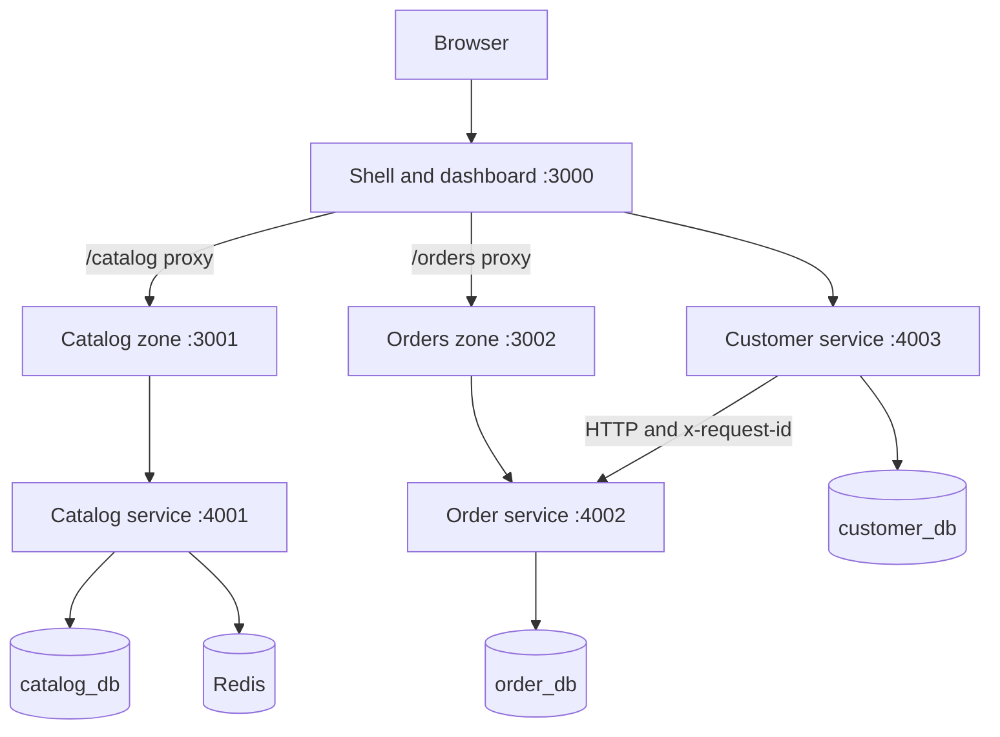
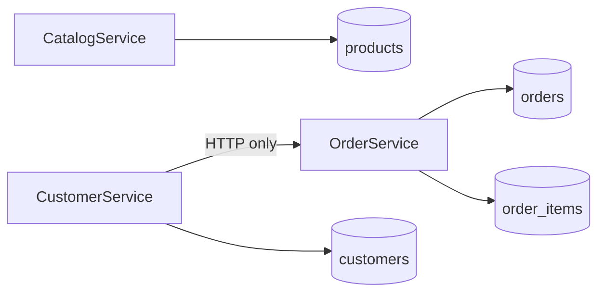

# Architecture

## Overall

The shell's proxy is local application composition, not a cloud gateway. Catalog and Orders remain independently runnable, built, and stoppable. Cross-zone anchors intentionally perform document navigation: opening the dashboard does not download either zone.

## Data ownership

One PostgreSQL process is economical locally, but separate databases and users enforce the intended service boundaries. Customer Service has no order database credentials. Order rows store product/customer IDs and product snapshots instead of cross-database foreign keys.

## Local runtime

Docker Compose creates one bridge network and eight containers: three frontends, three APIs, PostgreSQL, and Redis. Browser-visible URLs use `localhost`; container-to-container traffic uses Compose DNS names. PostgreSQL and Redis use named volumes.

The shell and Customer Service do not require their downstream frontend/Order Service to be healthy before starting. This preserves the failure isolation being demonstrated.
