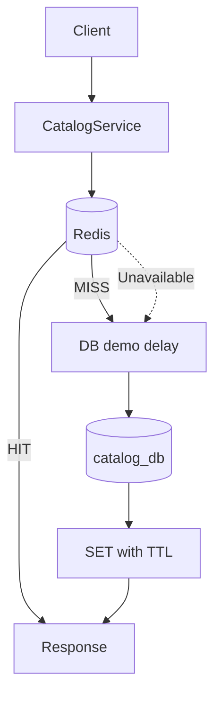

# Redis caching

Catalog Service uses cache-aside; PostgreSQL remains authoritative.

## Keys and TTL

- `product:{id}` caches one product.
- `products:list:{queryHash}` caches an unfiltered/search list page.
- `products:category:{category}:{queryHash}` caches a category page.

The default TTL is 60 seconds and is configurable with `CACHE_TTL_SECONDS`. TTL limits how long missed invalidations or out-of-band database changes can remain stale. It is not a correctness guarantee: data can still be stale inside that window.

## Invalidation

POST invalidates list/category entries. PUT and DELETE invalidate `product:{id}` plus all list/category entries. The implementation uses incremental Redis `SCAN`, not blocking `KEYS`, then deletes discovered keys. Invalidation is best-effort so a cache outage cannot make a successful database write fail.

This broad list invalidation is intentionally understandable for the POC. A high-volume system might use tagged keys, namespace versions, events, or CDC. Those designs reduce scanning but add metadata or eventual-consistency complexity.

## Visible behavior

Catalog responses expose:

- `X-Cache: HIT` when Redis supplied the body.
- `X-Cache: MISS` when Redis was checked and PostgreSQL supplied the body.
- `X-Cache: BYPASS` when `Cache-Control: no-cache` was requested or the route is a write/health path.
- `Server-Timing` with measured service duration.

Completion logs include request ID, service, endpoint, method, status, duration, and cache state.

## Redis failure

Redis is an optimization, not the source of truth. Connection/read/write errors are bounded and log `Redis unavailable; falling back to database`. Catalog then performs the PostgreSQL query and returns normally. The cache adapter reconnects on a later request after Redis returns.

## Trade-offs

Redis reduces repeated database work and makes the artificial slow path visibly faster. It adds memory cost, serialization, another process, invalidation logic, and stale-data risk. Caching low-reuse or rapidly changing queries may reduce reliability without delivering enough hits. A real system would measure hit rate, key cardinality, memory, and eviction before retaining each cache.
