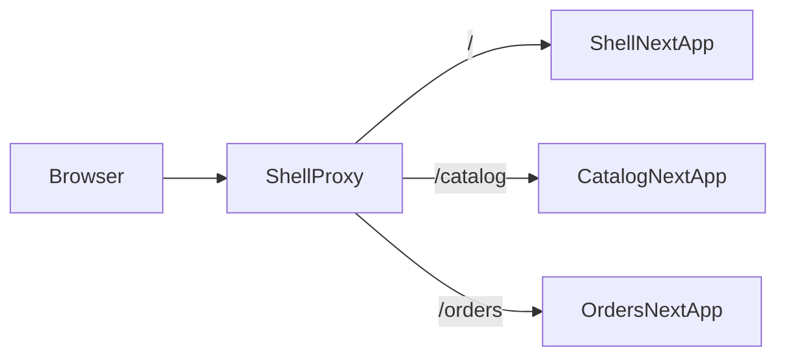

# Micro frontends

## Integration

The three Next.js applications are independent:

- Shell owns `/`, common navigation, customer dashboard, loading/error UI, and composition.
- Catalog owns `/catalog`.
- Orders owns `/orders`.

Catalog and Orders use `basePath`; the shell's small local Node proxy forwards those route families to the correct process. Each zone can be run and built from its own package. Shared navigation appearance is repeated by a small visual contract; no Catalog or Orders feature source is imported into Shell.

## Lazy loading and code splitting

Cross-zone navigation uses normal anchors instead of `next/link`. This is deliberate: Next.js must not prefetch another application's code as if it belonged to the current build. The initial dashboard waterfall contains only shell chunks. Catalog or Orders HTML/chunks are requested after navigation. Within each zone, Next performs route-level code splitting.

Catalog and Orders show skeletons while their API queries run. TanStack Query deduplicates requests, caches bounded stale data, and cancels stale search requests through its `AbortSignal`. Catalog search is debounced and both domains use pagination.

## Failure isolation

If a zone connection fails, `apps/shell/server.js` internally renders `/mfe-unavailable` with a domain-specific message. The shell process and the other zone are unaffected. A browser may retain already downloaded assets, so the demo should use a hard refresh after stopping a zone.

## Compatibility evidence

The first implementation attempted runtime Module Federation with:

- secure Next.js `15.5.24`
- React `19.1.1`
- `@module-federation/nextjs-mf` `8.8.74`
- local webpack, initially `5.110.3`, then unified on `5.98.0`

Both production builds failed with `_resolveContext_stack.delete is not a function`. The plugin is in maintenance mode and does not support Next.js 16. Downgrading Next.js would cross known critical security advisories. The approved implementation therefore moved to Next.js `16.3.4` Multi-Zones, Next.js's supported micro-frontend model.

## Trade-offs

Multi-Zones provide independent builds, route ownership, fault boundaries, and team autonomy without sharing a fragile runtime module graph. They do not provide component-level composition or soft navigation between zones; cross-zone navigation reloads the document and duplicated visual shell code must stay aligned. Runtime federation would offer finer composition and shared dependencies but adds version negotiation, duplicate-React risk, SSR complexity, and—here—a failed security/build compatibility gate.

For a small frontend owned by one team, ordinary route code splitting in one Next app is simpler. Use micro frontends when organizational ownership and independent release boundaries justify the extra routing, consistency, and testing cost.
