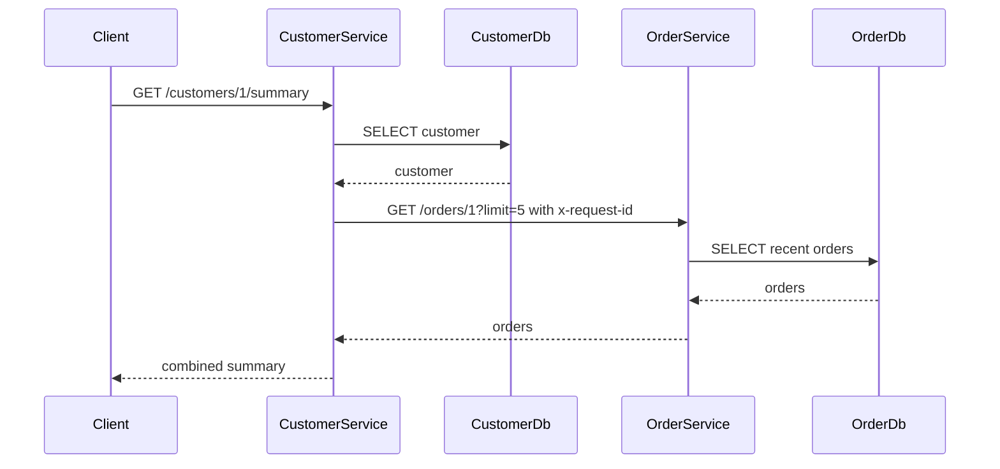

# Microservices

## Boundaries

- Catalog Service owns `products` and exposes `GET /products`, `GET /products/:id`, `POST /products`, `PUT /products/:id`, and `DELETE /products/:id`.
- Order Service owns `orders` and `order_items`; it exposes customer order list/detail and transactional order creation.
- Customer Service owns `customers`; it exposes customer detail and an aggregated summary.

Each service has an independent manifest, TypeScript build, configuration, test suite, database pool, Dockerfile, health endpoint, and process lifecycle. Shared types are compile-time contracts, not shared business or persistence logic.

## Service-to-service summary

Fastify accepts a caller's `x-request-id` or creates one. Customer Service forwards it, both services log it, and responses return it. The downstream call has a bounded timeout. If Order Service fails, Customer Service returns customer data, an empty order list, `degraded: true`, and an explanatory warning.

## Performance choices

- `pg.Pool` bounds/reuses connections.
- Parameterized SQL prevents injection and enables PostgreSQL plan reuse.
- Queries select only API fields.
- Product/order lists are paginated with maximum limits.
- Indexes cover product category/search, orders by customer/date, and items by order.
- Node/Fastify I/O remains asynchronous; compression applies where response size warrants it.

## Trade-offs in this POC

Independent ownership makes failures and change boundaries visible, and each image could be deployed separately. It also creates network latency and partial-failure states that a monolith avoids. Three pools, health checks, logs, configurations, databases, and API contracts are operational overhead for a small portal.

For a small single-team application with one release cadence, a modular monolith would likely be cheaper. This POC uses microservices because the review goal is to demonstrate ownership, HTTP composition, request correlation, and graceful degradation—not because three services are inherently required by the domain size.
